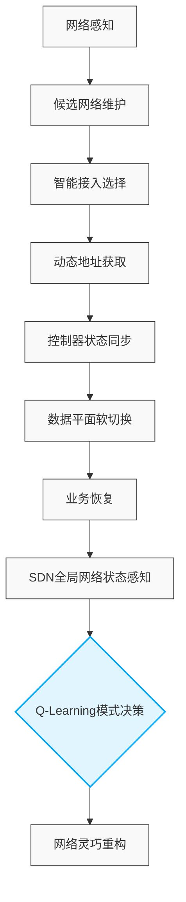
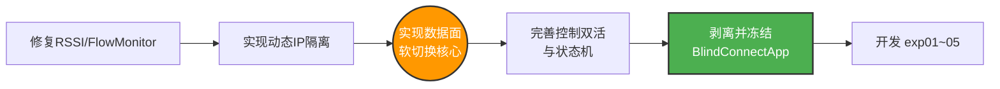

# 📑 论文实验整体研究主线与代码实现规划

> **核心论点：** 终端级临机入网 + 数据平面软切换 + 网络级智能重构。

## 一、 研究问题与系统逻辑

本次实验并非单纯验证 Q-Learning，而是围绕以下三个核心研究问题（Research Questions, RQ）展开：

*   **RQ1 (接入层面)：** 协同智能感知能否提高临机入网选择效果？
*   **RQ2 (切换层面)：** 双接口“控制双活、数据单活”机制能否降低跨域切换业务中断？
*   **RQ3 (网络层面)：** SDN + Q-Learning 能否根据网络状态自适应完成组网模式重构？

### ⚙️ 整体系统运行逻辑



---

## 二、 五组核心实验设计

### 🧪 实验一：临机入网流程有效性实验

**📁 代码文件：** `exp01-join-validation.cc`
**🎯 实验目的：** 证明移动终端能够完成跨异构域（`Domain A ➔ Domain C ➔ Domain B`）的完整临机入网。

*   **验证流程：** `First Seen` ➔ `Selected` ➔ `IP Request` ➔ `IP Offer` ➔ `IP Confirm` ➔ `Configured` ➔ `Sync` ➔ `First Data Rx`
*   **核心公式：**
    *   网络发现时延：$T_{discovery} = T_{selected} - T_{firstSeen}$
    *   地址分配时延：$T_{address} = T_{configured} - T_{request}$
    *   完整入网时延：$T_{join} = T_{firstDataRx} - T_{firstSeen}$
*   **📊 输出与图表：**
    *   **输出文件：** `join_events.csv`, `join_summary.csv`
    *   **当前事件列：** `time,domain,iface,event,step,txid,ip,mac,ssid,snr,hops,note`
    *   **关键事件名：** `FIRST_SEEN`, `SELECTED`, `IP_REQUEST`, `IP_OFFER`, `IP_CONFIRM`, `CONFIGURED`, `ADD_ARP_ENTRY`, `FIRST_DATA_RX`
    *   **指标取值口径：** `T_discovery = SELECTED - FIRST_SEEN`；`T_address = CONFIGURED - IP_REQUEST`；`T_join = FIRST_DATA_RX - FIRST_SEEN`
    *   **论文图表：** 三域入网时间轴图、入网时延柱状图、入网时延 CDF 曲线、入网成功率。

### 🧪 实验二：软切换与硬切换性能对比 (⭐️ 重点)

**📁 代码文件：** `exp02-soft-vs-hard-switch.cc`
**🎯 实验目的：** 验证基于“控制面双活”的软切换机制对降低业务中断时间的有效性。

| 切换类型         | 机制说明                                                     | 状态特点                 |
| :--------------- | :----------------------------------------------------------- | :----------------------- |
| **传统硬切换**   | 接口Down ➔ 控制资源停止 ➔ 重扫描 ➔ 重关联 ➔ 重配IP ➔ 业务恢复 | 控制/数据均中断          |
| **数据面软切换** | 仅切换 `dataActive` ➔ 更新默认路由 ➔ Socket重绑定 ➔ 发送门控更新 | `STA`与`AdHoc`控制面双活 |

*   **核心测试指标：** 业务中断时间（**严禁使用切换起止时间代替**）
    $$T_{interrupt} = T_{firstNewPathRx} - T_{lastOldPathRx}$$
*   **测试变量：** 移动速度 (5 m/s, 10 m/s, 20 m/s)
*   **📊 输出与图表：**
    *   **输出文件：** `switch_events.csv`, `switch_packets.csv`（当前先复用 `join_events.csv` 中的切换事件）
    *   **关键切换事件名：** `SWITCH_START`, `SWITCH_READY`, `DATA_SOCKET_BIND`, `DATA_PLANE_AP`, `DATA_PLANE_ADHOC`, `ROUTE_UPDATED`, `FIRST_DATA_RX`
    *   **中断计算口径：** 仍以业务包 `lastOldPathRx` / `firstNewPathRx` 为准，`SWITCH_START` / `SWITCH_READY` 只用于解释切换阶段，不直接代替业务中断时间。
    *   **论文图表：** 切换期间吞吐量-时间折线图、业务包序列-时间散点图、Hard vs Soft 中断时间箱线图、不同速度下切换成功率。

### 🧪 实验三：协同智能感知接入选择

**📁 代码文件：** `exp03-access-selection.cc`
**🎯 实验目的：** 对比单纯依赖信号强度的策略，验证多属性加权选择的优势。（*注：此阶段暂不加DQN*）

*   **对比策略：** `RSSI_ONLY` vs `WEIGHTED_MULTI_ATTRIBUTE`
*   **网络拓扑构造要求（必须引入真实业务流产生背景负载）：**
    *   📡 **AP-A：** RSSI 强，负载高，时延高
    *   📡 **AP-B：** RSSI 中等，负载低，QoS 好
    *   📡 **IBSS-C：** RSSI 较弱，跳数少，网络稳定
*   **评价指标 (Oracle 对比)：** 定义 `OracleBestNetwork = Max(吞吐量) + Min(Delay, Loss)`。
    $$WrongSelectionRate = \frac{N_{selected \neq oracle}}{N_{decision}}$$
*   **📊 输出与图表：** `selection_decisions.csv` / 综合 QoS 性能对比柱状图、乒乓切换率折线图。

### 🧪 实验四：Q-Learning 网络模式重构 (⭐️ 网络级决策)

**📁 代码文件：** `exp04-mode-reconfiguration.cc`
**🎯 实验目的：** 验证 SDN 控制器能否根据全局状态，自适应决定整个网络的组网模式（而非终端选择网络）。

*   **MDP 定义：**
    *   **状态 $S$：** $[Traffic, Mobility, Distribution, Link]$
    *   **动作 $A$：** $[KEEP, INFRASTRUCTURE/MULTI\_CENTER, ADHOC]$
*   **对比基线：** `FIXED_INFRASTRUCTURE` vs `FIXED_ADHOC` vs `Q_LEARNING_ADAPTIVE`
*   **业务阶段（严禁硬编码切换时间）：** 
    `0~30s (正常负载)` ➔ `30~70s (突发负载)` ➔ `70~100s (恢复期)`
*   **📊 输出与图表：**
    *   **输出文件：** `mode_decisions.csv`, `mode_flow_metrics.csv`
    *   **论文图表：** 吞吐量/丢包/时延-时间图、网络模式演进时间轴、Q-Learning 奖励收敛曲线。

### 🧪 实验五：规模与鲁棒性实验

**📁 代码文件：** `exp05-scalability-robustness.cc`
**🎯 实验目的：** 测试系统在扩大规模和面临故障时的表现，重点验证重构时间 $T_{reconfiguration} \leq 5s$。

*   **测试变量：**
    *   **节点规模：** 10, 30, 50, 80, 100
    *   **故障注入：** AP 宕机、骨干网拥塞、信道干扰、突发巨量流量
*   **📊 输出与图表：** `scalability_summary.csv` / 规模-时延折线图、故障恢复期吞吐量变化图。

---

## 三、 代码整体实现架构

> **💡 核心设计原则：** `BlindConnectApp` 只负责实现**底层机制**（感知、候选、IP、数据面切换），**不实现**具体论文实验逻辑。实验的场景、变量、业务流、统计全部由 `exp01~05` 文件负责。

```bash
multimodal-network/
├── common/                  # 公共统计与拓扑构建
│   ├── experiment-config.{h,cc}
│   ├── experiment-logger.{h,cc}
│   ├── experiment-metrics.{h,cc} 
│   ├── topology-builder.{h,cc}
│   └── traffic-builder.{h,cc}
├── access/                  # 接入选择策略模块
│   ├── candidate-network-table.{h,cc}
│   ├── rssi-selection.{h,cc}
│   └── weighted-selection.{h,cc}
├── scenarios/               # 🚀 五大核心实验场景
│   ├── exp01-join-validation.cc
│   ├── exp02-soft-vs-hard-switch.cc
│   ├── exp03-access-selection.cc
│   ├── exp04-mode-reconfiguration.cc
│   └── exp05-scalability-robustness.cc
└── run/                     # 自动化执行脚本
    └── run-exp01~05.sh
```

---

## 四、 当前开发进度与执行流

### 1. 代码缺陷修复状态 (Audit Status)

| 优先级 | 任务模块                       | 当前状态 | 备注说明                     |
| :----: | :----------------------------- | :------: | :--------------------------- |
| **P0** | 修正 RSSI/SNR 物理语义         |    ✅     | 基本完成，需避免算法重复赋权 |
| **P0** | `FlowMonitor` 指标统计准确性   |    ⚠️     | Claude已改，需做专项审计     |
| **P0** | 剥离硬编码IP，实现动态IP隔离   |    ⚠️     | 已部分修改                   |
| **P0** | **真正的数据面业务切换逻辑**   |    ❌     | **当前最大阻碍，需优先实现** |
| **P1** | 控制平面 Socket 双活机制       |    ⚠️     | 已部分修改                   |
| **P1** | Fallback 异常回退状态机        |    ❌     | 需要彻底重构                 |
| **P1** | `CandidateNetworkTable` 模块化 |    ❌     | 尚未正式完成                 |
| **P1** | IP Transaction (引入 TXID)     |    ⚠️     | 已部分加入                   |

### 2. 正确的开发执行流 (Roadmap)

切忌现在就开始写 `exp01` 到 `exp05`，必须先夯实底层机制：



---

## 🎁 附录：论文实验全景映射表

照着这张表进行开发和撰写论文，逻辑会非常严密：

|  实验编号  | 验证的核心论点         | 调用的核心代码模块                            | 抓取的关键指标 (Metrics)                   | 对应的论文图表                            |
| :--------: | :--------------------- | :-------------------------------------------- | :----------------------------------------- | :---------------------------------------- |
| **Exp-01** | 能跨异构域完整入网     | `BlindConnectApp` (IP分配状态机)              | $T_{discovery}$, $T_{address}$, $T_{join}$ | 入网流程时间轴图、时延 CDF 曲线           |
| **Exp-02** | 软切换能显著降中断     | `SetDataPlaneActive()`<br>`BindDataSockets()` | $T_{interrupt}$, $DropRatio$               | Hard vs Soft 中断箱线图、切换期吞吐量折线 |
| **Exp-03** | 协同感知选得准         | `WeightedSelection`<br>`CandidateTable`       | $WrongSelectionRate$, 吞吐量/时延          | 综合 QoS 柱状图、乒乓效应对比图           |
| **Exp-04** | 网络具备自适应重构能力 | `EvaluateNetworkState`<br>`QLearningAgent`    | Reward, 模式驻留时间, 整体 QoS             | Q-Learning 收益收敛图、网络模式时序演进图 |
| **Exp-05** | 规模扩大与故障时仍有效 | `TopologyBuilder` (规模调整与故障注入)        | $T_{reconfiguration}$ (<5s), 整体开销      | 规模-时延折线图、故障期吞吐量恢复图       |